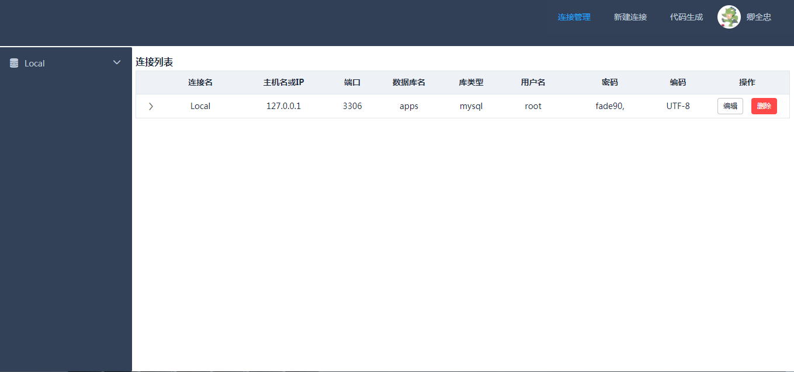
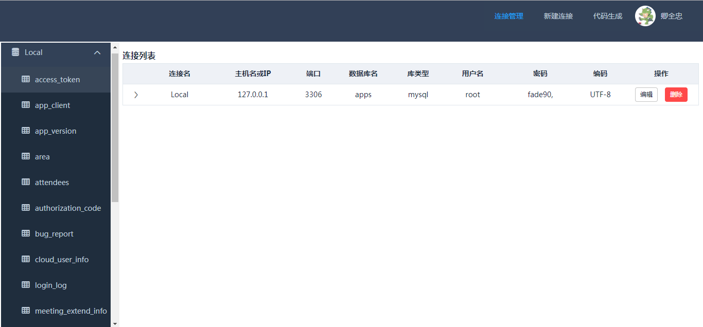
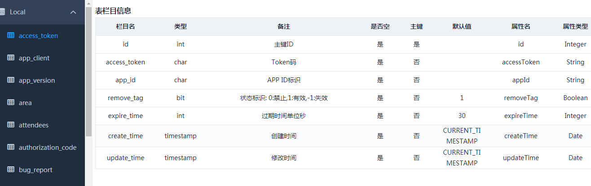
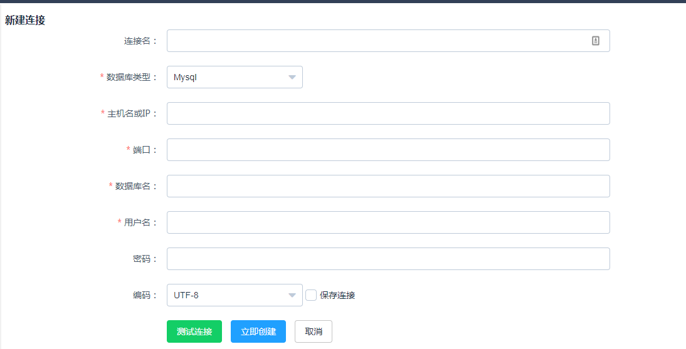
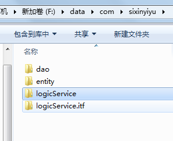
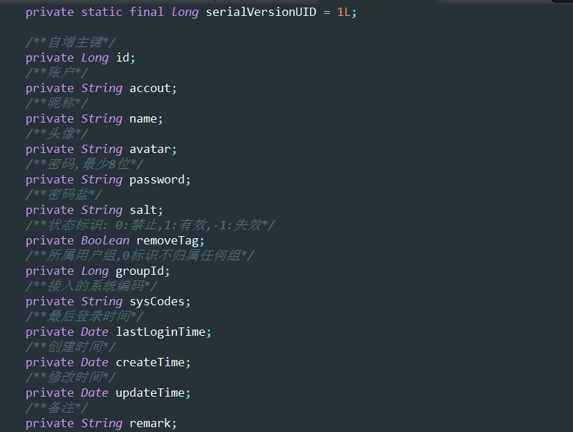
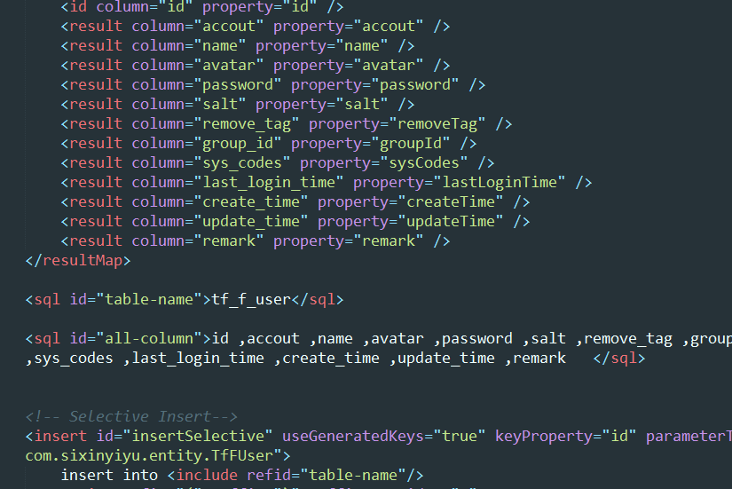
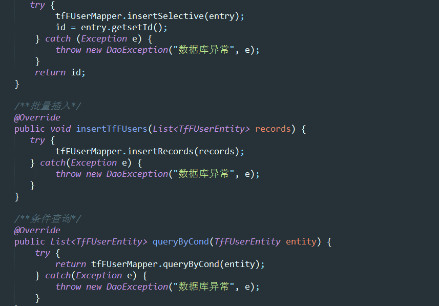

# Mybatis代码自动生成工具

## 相关技术

   * Java8
   * SpringBoot
   * Velocity
   * PageHelper(分页查询使用V:5.0.2)
   * Vue.js+Element-UI
   
## 项目截图

首页(数据库连接列表)：

指定连接下表：

指定表下栏目：

新建数据库连接：

代码生成参数：

生成文件：

实体代码：

Mybatis配置：

逻辑服务

## 运行

mvn install -Dmaven.test.skip=true

java  -jar boot.jar -jar mybatis-generator-helper-0.0.1-SNAPSHOT.jar --server.port=9090

1) 首先新建数据库连接(连接可以选择保存本地)
2) 指定初始化加载某连接
3) 填写自动生成所需配置
4) 执行代码生成即可

## 开发计划

   * version 1.1 [planning]
   * (1) 模版更灵活化
   * (2) 生成更多通用代码

   * version 1.0 [finished]
   * ~~(1) 项目搭建~~
   * ~~(2) 基于模版的项目生成~~
   * ~~(3) 可配置化
   * ~~(4) 前端代码   
   
   
## 相关信息

 此项目平时学习开发过程中用来快速开发，节省约会时间。
 有任何问题可以联系[qingquanzhong@126.com]